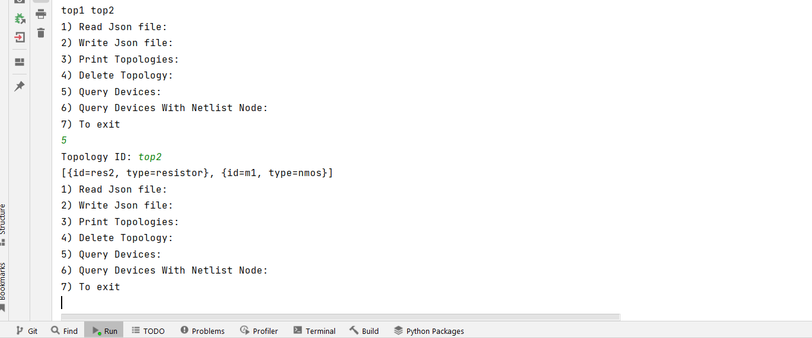

<div align="center">

# Topology API

</div>

<div align="center">

[//]: # ([![contributors]&#40;https://img.shields.io/github/contributors/ZiadSheriif/Topology-API&#41;]&#40;https://github.com/ZiadSheriif/Topology-API/contributors&#41;)
[](LICENSE)
[](https://github.com/ZiadSheriif/Topology-API/network)
[](https://github.com/ZiadSheriif/Topology-API/stargazers)

[//]: # ([![issues]&#40;https://img.shields.io/github/issues/ZiadSheriif/Topology-API&#41;]&#40;https://github.com/ZiadSheriif/Topology-API/issues&#41;)

</div>

Provide the functionality to access, manage and store device topologies.

## Description
1. Read a topology from a given JSON file and store it in the memory.
2. Write a given topology from the memory to a JSON file.
3. Query about which topologies are currently in the memory.
4. Delete a given topology from memory.
5. Query about which devices are in a given topology.
6. Query about which devices are connected to a given netlist node in
   a given topology.

## Getting Started

### Dependencies

* Java
* json.simple

### Installing

```
git clone https://github.com/ZiadSheriif/Topology-API 
```

### Screenshots

#### Read JSON file


#### Query Topologies


#### Output File


#### Read JSON file & Query Topologies


#### Query devices in a topology


#### Delete a topology & Query Topologies


## Contributors

<table>
<tr>
<td align="center">
<a href="https://github.com/ZiadSheriif" target="_black">
<br /><sub><b>ZiadSherif</b></sub></a><br />
</td>
</tr>
 </table>